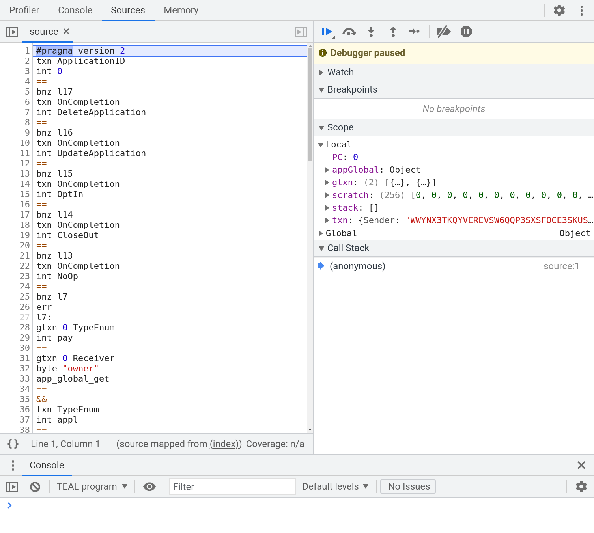

# Debugging and Algorand Smart Contract

## Overview

This tutorial will cover debugging a stateful smart contract using `tealdbg`, the TEAL debugger. The smart contract in this tutorial is a simple program with an intentional bug. The `tealdbg` will be used to uncover the bug and fix it.

The smart contract is written in PyTEAL and interfaced with the `goal` program.

## Requirements

- Access to an Algorand network and at least two funded accounts
- PyTEAL
- An understanding of TEAL code
- `goal`
- `tealdbg`
- Chrome web browser (other browsers are possible, but the experience is not as good)

## (Buggy) Smart Contract

The following is the PyTEAL code for a simple stateful smart contract. The smart contract records an owner address (the creator) during initialization. It then keeps track of a counter value. Whenever the owner receives a transaction with >= 10 Algos, the counter will be incremented, otherwise, it will be decremented. This functionality is executed as a group transaction where the first transaction is the payment to the owner and the second, the call to the smart contract.

```python
from pyteal import *

var_owner = Bytes("owner")
var_counter = Bytes("counter")

def buggy_program():
    """
    This is a stateful smart contract with a purposeful bug.
    It is used to demonstrate using the debugger to uncover the bug.
    """
    init_contract = Seq([
        App.globalPut(var_owner, Txn.sender()),
        App.globalPut(var_counter, Int(0)),
        Return(Int(1))
    ])

    is_owner = Txn.sender() == App.globalGet(var_owner)

    # Assign the transactions to variables
    payment_txn = Gtxn[0]
    app_txn = Txn # This transaction is at index 1

    payment_check = payment_txn.type_enum() == TxnType.Payment
    payment_receiver_check = payment_txn.receiver() == App.globalGet(var_owner)
    app_check = app_txn.type_enum() == TxnType.ApplicationCall

    group_checks = And(
        payment_check,
        payment_receiver_check,
        app_check,
    )

    counter = App.globalGet(var_counter)
    increment_counter  = Seq([
        Assert(group_checks),
        # Increment the counter if the sender sends the owner more than 10 Algos.
        # Otherwise decrement the counter
        If(payment_txn.amount() >= Int(10 * 1000000),
           App.globalPut(var_counter, counter + Int(1)),
           App.globalPut(var_counter, counter - Int(1)),
        ),

        Return(Int(1))
    ])

    program = Cond(
        [Txn.application_id() == Int(0), init_contract],
        [Txn.on_completion() == OnComplete.DeleteApplication, Return(is_owner)],
        [Txn.on_completion() == OnComplete.UpdateApplication, Return(is_owner)],
        [Txn.on_completion() == OnComplete.OptIn, Return(Int(1))],
        [Txn.on_completion() == OnComplete.CloseOut, Return(Int(1))],
        [Txn.on_completion() == OnComplete.NoOp, increment_counter],
    )

    return program

if __name__ == "__main__":
    print(compileTeal(buggy_program(), Mode.Application))
```

This stateful smart contract has two important code blocks `init_contract` and `increment_counter`. 

The `init_contract` block is called during contract deployment and simply initializes the owner and counter global variables.
```python
init_contract = Seq([
    App.globalPut(var_owner, Txn.sender()),
    App.globalPut(var_counter, Int(0)),
    Return(Int(1))
])
```

The `increment_counter` block is executed during any normal application call. It performs the logic which checks if the owner is receiving more or less than 10 Algos and increments/decrements the counter respectively.

It begins by checking the structure of the group transaction, that the first transaction is a payment transaction to the owner and that the second transaction is an application call to this smart contract.
```python
# Assign the transactions to variables
payment_txn = Gtxn[0]
app_txn = Txn # This transaction is at index 1

payment_check = payment_txn.type_enum() == TxnType.Payment
payment_receiver_check = payment_txn.receiver() == App.globalGet(var_owner)
app_check = app_txn.type_enum() == TxnType.ApplicationCall

group_checks = And(
    payment_check,
    payment_receiver_check,
    app_check,
)
```

Second, it performs the increment/decrement accordingly.

```python
counter = App.globalGet(var_counter)
increment_counter  = Seq([
    Assert(group_checks),
    # Increment the counter if the sender sends the owner more than 10 Algos.
    # Otherwise decrement the counter
    If(payment_txn.amount() >= Int(10 * 1000000),
       App.globalPut(var_counter, counter + Int(1)),
       App.globalPut(var_counter, counter - Int(1)),
    ),

    Return(Int(1))
])
```

There is a bug in this smart contract, but where?!? If you are used to writing TEAL smart contracts, you may be able to spot it, but this bug is honestly inconspicuous.

## Exposing the Bug

### Deploying the Smart Contract

Before we can call the smart contract to see the effects of the bug, we must deploy the smart contract. This call will return the `APP_ID` of the smart contract; be sure to remember it for later.

```bash
# Make the approval program
python3 approval_program.py > approval_program.teal

goal app create --creator <OWNER> --global-byteslices 1 --global-ints 1 --local-byteslices 0 --local-ints 0 --approval-prog approval_program.teal --clear-prog clear_program.teal
```

### Non-buggy Smart Contract Call

Once the smart contract is deployed, let's call it normally. This call will not expose the bug. Recall, in order to call the contract, it will have to be as a group transaction where the first transaction is a payment to the owner and the second transaction is the call to the smart contract. These transactions are created individually, grouped together, signed, and then sent.

```bash
# Create the unsigned transactions
goal clerk send --amount 10000000 --from <ACCOUNT2> --to <OWNER> --out ./unsginedtransaction1.tx    # Sends 10 Algos to OWNER
goal app call --app-id <APP_ID> --from <ACCOUNT2> --out ./unsginedtransaction2.tx

# Atomically group the transactions
cat unsginedtransaction1.tx unsginedtransaction2.tx > combinedtransactions.tx
goal clerk group -i combinedtransactions.tx -o groupedtransactions.tx

# Sign the group transaction (Can be signed as a whole since it is coming from the same sender ACCOUNT2)
goal clerk sign -i groupedtransactions.tx -o signout.tx

# Send the group transaction to the network
goal clerk rawsend --filename signout.tx
```

Now let's view the global state of the smart contract. The counter should have been incremented to 1 since this transaction was for 10 Algos.

```bash
goal app read --global --app-id <APP_ID>
```

```bash
# Output
{
  "counter": {
    "tt": 2,
    "ui": 1    # Counter value is 1
  },
  "owner": {
    "tb": "\ufffd%b\ufffd\ufffd\n\ufffd\u001e\ufffdYMFȡ\ufffd\ufffd\ufffd\ufffd\u0004\ufffd\ufffd\ufffdc1\ufffd\ufffd\u0010\ufffd\u001a\ufffdP{",
    "tt": 1
  }
}
```

### Buggy Smart Contract Call

However, the smart contract is secretly buggy. Let's see if we can expose this bug. With the current global state, we will need to send two group transactions each with a value less than 10 Algos to expose the bug.

This is the same code as above, just that the sending amount is 9 Algos instead of 10. Run this code twice. The first run should succeed just fine, but the second should fail.

```bash
# Create the unsigned transactions
goal clerk send --amount 9000000 --from <ACCOUNT2> --to <OWNER> --out ./unsginedtransaction1.tx    # Sends 9 Algos to OWNER
goal app call --app-id <APP_ID> --from <ACCOUNT2> --out ./unsginedtransaction2.tx

# Atomically group the transactions
cat unsginedtransaction1.tx unsginedtransaction2.tx > combinedtransactions.tx
goal clerk group -i combinedtransactions.tx -o groupedtransactions.tx

# Sign the group transaction (Can be signed as a whole since it is coming from the same sender ACCOUNT2)
goal clerk sign -i groupedtransactions.tx -o signout.tx

# Send the group transaction to the network
goal clerk rawsend --filename signout.tx
```

The second run should produce an error similar to this one:

```bash
Warning: Couldn't broadcast tx with algod: HTTP 400 Bad Request: TransactionPool.Remember: transaction <TXN-HASH>: logic eval error: - would result negative
Encountered errors in sending 2 transactions:
  <TXN-HASH>: HTTP 400 Bad Request: TransactionPool.Remember: transaction <TXN-HASH>: logic eval error: - would result negative
  <TXN-HASH>: HTTP 400 Bad Request: TransactionPool.Remember: transaction <TXN-HASH>: logic eval error: - would result negative
Cannot write file signout.tx.rej: open signout.tx.rej: file exists
```

There is some unhandled error in this smart contract relating to `"would result negative"`. Let's use the `tealdbg` debugger to better understand what is going wrong and fix this issue.

### Debugging the Smart Contract

#### Set Up

In order to debug a smart contract, two sources are necessary:
1. The smart contract TEAL code (already have this)
2. The debugger context

The debugger context contains all of the necessary information (the transactions being issued, the global and local state, etc.) for the debugger to recreate the same environment where the smart contract failed.

Instead of sending the `signout.tx` from the second attempt which failed, we are going to dryrun it and save the debugger context.

```bash
# Generate the context debug file
goal clerk dryrun -t signout.tx --dryrun-dump -o dr.msgp
```

The `dr.msgp` file is the debugger context. Now we can launch `tealdbg` and begin debugging the buggy call to the smart contract.

```bash
# The smart contract transaction is at index 1 within the group
tealdbg debug approval_program.teal -d dr.msgp --group-index 1
```

#### Connecting to the Debugger

This will launch a debugger instance accessible through the Chrome web browser's debug console. It is possible to access the debugger through other web-browsers by adding the flag `--frontend web`, but the experience is not as good. This tutorial will debug the smart contract through the Chrome interface.

To open the debugger in Chrome, connect to the debugger. Enter `chrome://inspect/` in the URL field, then click **Configure** and add `localhost:9392` as a target. The Algorand TEAL Debugger should appear as a Remote Target; click **inspect** to open up the debugger.

<p align="center">
  
</p>

#### Debugging

Once you click inspect, the debugger should be visible in full. The source code is the TEAL code of the smart contract. In order to debug smart contracts, you must be at least able to read and understand TEAL code.

<p align="center">
  
</p>

On the top right, there are a few arrow-shaped buttons to control the execution of the program. The most useful is the "Step" button (F9) which progresses the smart contract one step. When executing a smart contract in the debugger, none of the code causes any on-network effects. So for example, if there is a global value being set, this will be visible in the debugger environment only and will not take effect on the actual Algorand network.

On the right, there is a "Scope" panel that lists the current debugger environment state. This state includes global variables, local variables, any scratch space, and the stack. For this tutorial, we will monitor the stack to see how the bug surfaces. Make sure to click the dropdown arrow next to the "Stack" to inspect its contents.

<p align="center">
  
</p>

##### Lines 2 - 24

Stepping through the smart contract, lines 2 through 24 of the TEAL program correspond to the `Cond` statement in the PyTEAL program. Stepping through the teal program, you will see on the stack how the `txn OnCompletion` always pushes a 0 onto the stack. Since the transaction we are debugging was an ordinary call to the smart contract, it is of type NoOp which if value 0. Finally, the last block, lines 22 -24, evaluates to True and performs a jump to the `increment_counter` block of the PyTEAL program.

```python
program = Cond(
    [Txn.application_id() == Int(0), init_contract],
    [Txn.on_completion() == OnComplete.DeleteApplication, Return(is_owner)],
    [Txn.on_completion() == OnComplete.UpdateApplication, Return(is_owner)],
    [Txn.on_completion() == OnComplete.OptIn, Return(Int(1))],
    [Txn.on_completion() == OnComplete.CloseOut, Return(Int(1))],
    [Txn.on_completion() == OnComplete.NoOp, increment_counter],    # This condition evaluates to True
)
```

##### Lines 28 - 39

Lines 28 through 39 of the TEAL program correspond to the `group_checks` condition. It checks that the first transaction in the group is a payment transaction, that the receiver of that payment is the address stored in the "owner" global variable and that the second transaction in the group is an application call.

```python
# All checks evaluate to True
group_checks = And(
    payment_check,
    payment_receiver_check,
    app_check,
)
```

##### Lines 43 - 60

Lines 43 through 60 of the TEAL program correspond to the `If` statement inside of the `increment_counter` PyTEAL block. This performs the logic of the smart contract where if the payment in the first transaction is greater than or equal to 10 Algos, it increments the `counter` global variable. Otherwise, it decrements the `counter` global variable.

```python
counter = App.globalGet(var_counter)
If(payment_txn.amount() >= Int(10 * 1000000),
   App.globalPut(var_counter, counter + Int(1)),
   App.globalPut(var_counter, counter - Int(1)),
),
```

Stepping through the smart contract, line 43 pushes `9000000` (9 Algos) to the stack and line 44 pushes `10000000` (10 Algos). The `>=` comparison on line 45 will push a `0` (False), and thus the branch on line 46 will not be taken.

<p align="center">
  
</p>

Lines 47 through 51 are the decrementing (False) branch of the `If` statement. Line 49 loads the current value of the `counter` onto the stack. This should be 0. Line 50 loads the number 1 and line 51 subtracts the latter from the former (0 - 1). However, stepping on line 51 raises an exception. We have located our bug!

<p align="center">
  
</p>

You can view in the "Scope" panel an entry titled "Exception" with the error `"would result negative"`. Digging around the Algorand documentation, one of the sections [here](https://developer.algorand.org/docs/features/asc1/stateless/walkthrough/#passing-parameters-to-teal-with-goal "here") states that "TEAL currently does not support negative numbers". Since we are subtracting `0 - 1` which is a negative result, the TEAL runtime throws its exception.

#### Fixing the Bug

Let's fix this bug. One way would be to have a second `If` inside of the decrementing (False) branch which checks that `counter > 0` and only subtracts then. Let's do that.

```python
counter = App.globalGet(var_counter)
If(payment_txn.amount() >= Int(10 * 1000000),
   App.globalPut(var_counter, counter + Int(1)),
   If(counter > Int(0),
      App.globalPut(var_counter, counter - Int(1)),
   ),
),
```

This should do the trick. Now we have to recompile the PyTEAL smart contract and send the updated smart contract to the network.

```bash
# Make the approval program
python3 approval_program.py > approval_program.teal

goal app update --app-id <APP_ID> --from <OWNER> --approval-prog approval_program.teal --clear-prog clear_program.teal
```

### Testing the Patch

Upon updating the smart contract with the patch, let's make sure that this bug is resolved.

First, let's view the smart contract's global state to make sure that the `counter` has a value of 0, and then we will send a payment transaction with less than 10 Algos to try to decrement it. Originally, this caused an exception. Now, the smart contract should simply not decrement and leave the `counter` at 0.

```bash
goal app read --global --app-id <APP_ID>
```

If the `counter` is 0, this should output:

```bash
{
  "counter": {    # No "ui" field means a value of 0
    "tt": 2
  },
  "owner": {
    "tb": "\ufffd%b\ufffd\ufffd\n\ufffd\u001e\ufffdYMFȡ\ufffd\ufffd\ufffd\ufffd\u0004\ufffd\ufffd\ufffdc1\ufffd\ufffd\u0010\ufffd\u001a\ufffdP{",
    "tt": 1
  }
}
```

If your `counter` is non-zero for whatever reason, send a few transactions with less than 10 Algos to decrement it down to 0. (To send such transaction follow the following code block which used to trigger the bug. It is the same transaction.)

Now let's try to trigger the bug. Sending a transaction with less than 10 Algos when the `counter` is 0 used to cause an exception. The update should fix this behavior and simply leave the `counter` at 0 without exception.

```bash
# Create the unsigned transactions
goal clerk send --amount 9000000 --from <ACCOUNT2> --to <OWNER> --out ./unsginedtransaction1.tx    # Sends 9 Algos to OWNER
goal app call --app-id <APP_ID> --from <ACCOUNT2> --out ./unsginedtransaction2.tx

# Atomically group the transactions
cat unsginedtransaction1.tx unsginedtransaction2.tx > combinedtransactions.tx
goal clerk group -i combinedtransactions.tx -o groupedtransactions.tx

# Sign the group transaction (Can be signed as a whole since it is coming from the same sender ACCOUNT2)
goal clerk sign -i groupedtransactions.tx -o signout.tx

# Send the group transaction to the network
goal clerk rawsend --filename signout.tx
```

Sending this group transaction with a payment of 9 Algos (< 10 Algos) succeeds without error! 

Looking at the global state again shows that the counter is still at 0 as anticipated.

```bash
goal app read --global --app-id <APP_ID>
```

## Conclusion

This tutorial covers the process of debugging a smart contract from start to finish. Neither the smart contract nor the bug within is complicated to understand, but the debugging steps are essentially the same for any Algorand application, making this a valuable example.

The topics covered in this tutorial include:

- Deploying a simple smart contract
- Exposing a bug in the smart contract
- Setting up the debugger within the Chrome debug console
- Preparing the debugger context and transaction data that trigger the bug
- Using `tealdbg` to load and step through the smart contract TEAL code
- Identifying and patching the bug
- Validating that the bug is indeed fixed

**This solution is intended for learning purposes only. It does not cover error checking and other edge cases therefore, should not be used as a production application.** This code is free to be used as outlined in the MIT License.